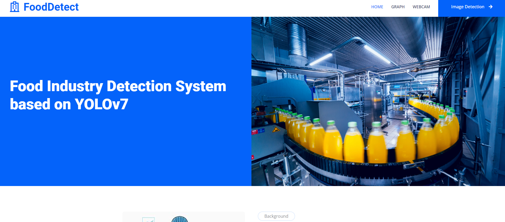

# PPE-Detection-System-in-Food-Industry-YOLO

Ensuring safety and hygiene in the food industry is crucial to prevent contamination and safeguard public health, with Personal Protective Equipment (PPE) playing a key role. However, compliance with PPE protocols remains challenging. The develop system is build using deep learning-based automated detection systems to monitor PPE compliance among food operators, aiming to enhance safety standards and prevent foodborne illnesses.

## Features

- **Image Detection**: The system accurately detects and classifies PPE attire in images based on compliance settings. It can identify various types of PPE such as gloves, aprons, hairnets, face masks, and footwear.
- **Webcam Detection**: Real-time detection of PPE using webcam feeds, allowing continuous monitoring and immediate compliance checks.

## Table of Contents
1. [Installation](#installation)
2. [Usage](#usage)
3. [Screenshots](#screenshots)

## Installation

To set up the project locally, follow these steps:

1. **Clone the repository:**
   ```bash
   git clone https://github.com/HafizulIkram/PPE-Detection-System-in-Food-Industry-YOLO.git
   cd PPE-Detection-System-in-Food-Industry-YOLO

2. **Create and activate a virtual environment**
    ```bash
   python -m venv venv
   source venv/bin/activate  # On Windows use `venv\Scripts\activate`


## Usage


1. **Clone the repository:**
   ```bash
   python webapp.py

## Screenshots

### Homapage


### Webcam Page
  


### Image Detection Page
     


## Technologies Used

- Python
- Flask
- YOLO
  


